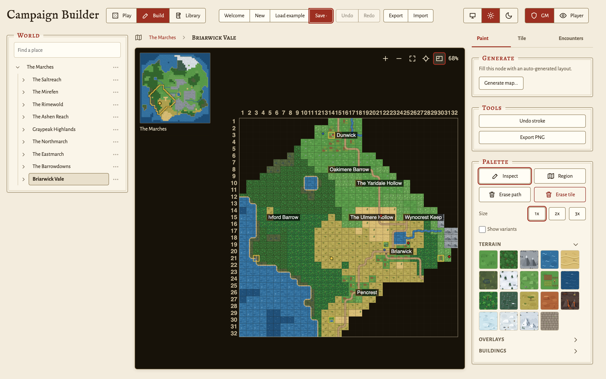
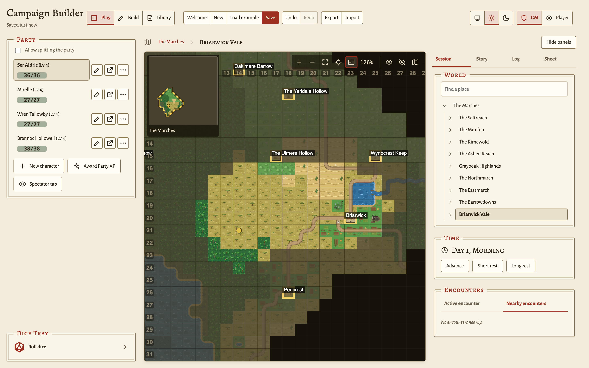
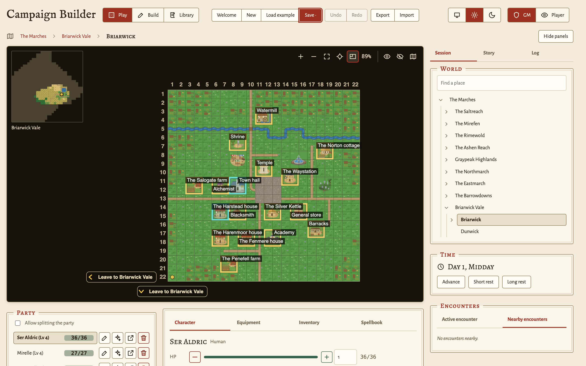
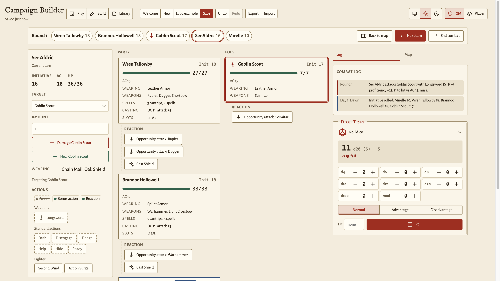
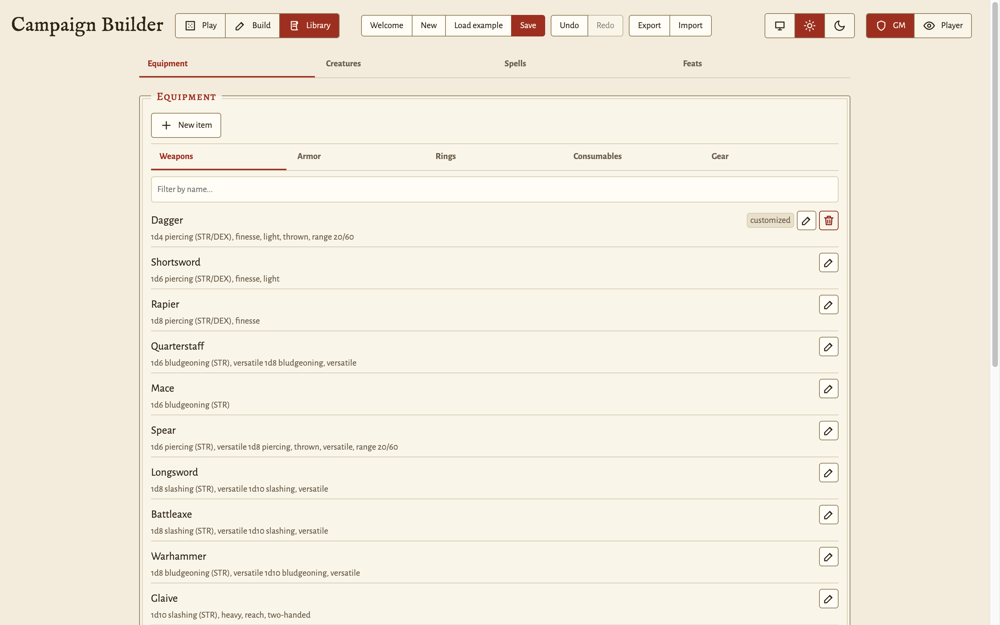
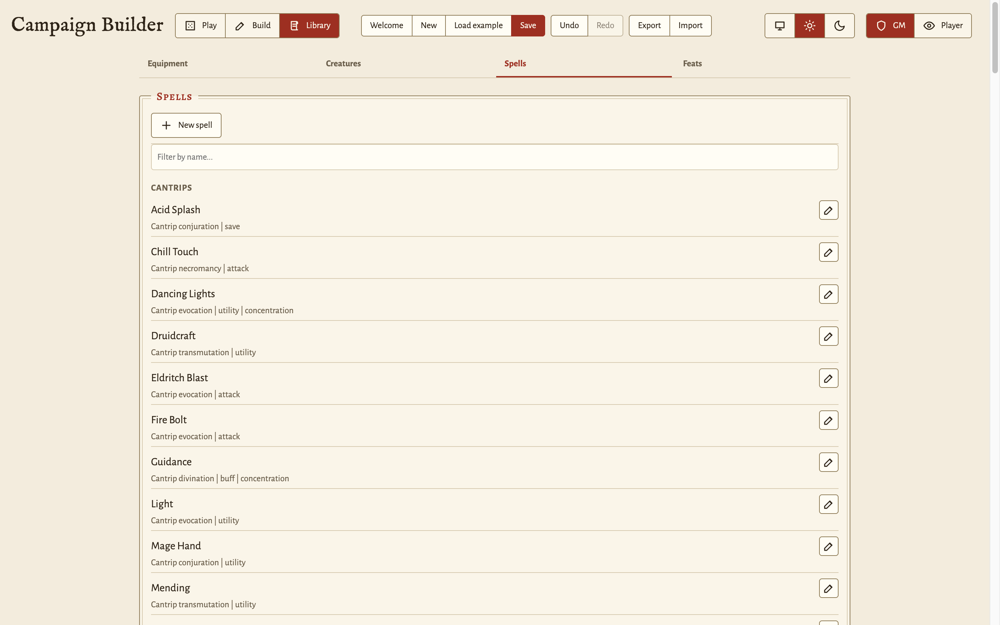
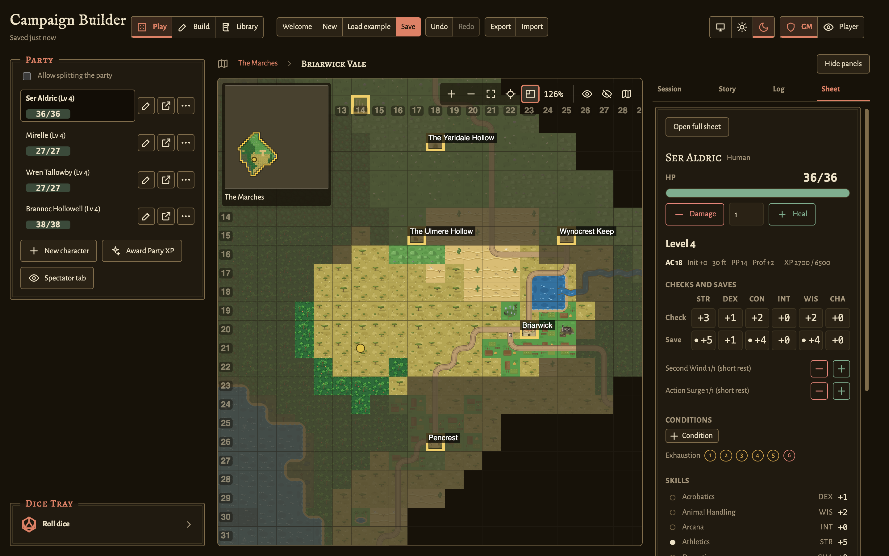

# GM guide

*How-to guide. Each section is one task. For what a control means, read the
[GM reference](gm-reference.md). If you are new to the app, do the
[first session tutorial](tutorial-gm-first-session.md) first.*

Each task in this guide starts with the app open in a browser, in the GM
role. To start the app, follow [Quick start](../README.md#quick-start) in
the README.

The header has two switches that control what you see. The mode switch
selects **Play**, **Build**, or **Library**. The role switch, with the label
**Viewer**, selects **GM** or **Player**. If a control in a task does not
show, set the mode that the task names and set the role to GM.

## Start a campaign

### Start from nothing

On the first visit, with no saved campaign, the app opens with one empty
world map. To start again later:

1. Click **New** in the header.
2. Click **New campaign** in the confirmation.

The app replaces the current campaign and its save. The confirmation says
whether **Undo** can restore the old campaign.

### Start from the example campaign

1. Click **Load example** in the header.
2. If a confirmation opens, click **Load example** in it.
3. Switch to Play mode and move the party to see how the parts fit
   together.

[The example campaign](gm-reference.md#the-example-campaign) in the GM
reference describes its world, story, and party.

### Start from a file

1. Click **Import** in the header.
2. Pick a `.json` file that you exported earlier.
3. Click **Import** in the confirmation. The app asks only when a campaign
   is already open.
4. If the file contains library customizations and you already have your
   own, the app asks whether to replace them. Click **Replace** to use the
   ones from the file, or **Cancel** to keep yours.

The campaign imports in both cases, and the page reloads. If the file is
not a campaign file, a message says so and nothing changes.

## Save and back up

1. Click **Save**, or press Ctrl+S (Cmd+S on a Mac). While you have
   unsaved changes, the button reads **Save •**.
2. Before a large edit, click **Export**. The browser downloads the whole
   campaign as a `.json` file. The file also contains your library
   customizations, so one export moves both.
3. Keep the exported file in a safe place. It is the only copy outside this
   browser.

To go back one step, click **Undo** in the header. Undo goes back to the
state before your last Save, New, Load example, or Import. **Redo** goes
forward again.

- If you save after you undo, the app discards the steps that Redo could
  restore.
- If you have unsaved changes, Undo and Redo ask first, because the step
  discards those changes.
- In Build mode, Ctrl+Z (Cmd+Z) undoes the last paint stroke instead. See
  [Paint tiles](#paint-tiles).

## Drive a player-facing display

A Player tab shows the world as your players see it: no GM notes, no exact
HP for foes, and only the tiles that the party has revealed.

1. Click **Save** in your GM tab. Other tabs show only what you saved.
2. In the **Party** panel below the map, click **Spectator tab** below the
   roster. A new browser tab opens in the Player view. You can also add
   `?role=player` to the URL of a tab yourself.
3. Put that tab on the display that faces the table.
4. To lock the tab when it has no URL parameter, click the padlock beside
   the role switch in that tab, then click **Lock**.

A locked tab hides the role switch. It cannot show the GM view again until
you close the tab or remove the URL parameter.

> **Warning:** The Player view is a display setting, not a security
> control. Each tab of the same browser reads the same saved campaign. A
> person at that browser can open the developer tools and read the whole
> save. The save contains the fog, the tile notes, the hidden handouts, and
> the exact HP of each foe. The same person can also remove `?role=player` from
> the URL. Put a player-facing tab only on hardware that you control, such
> as a second screen or your own laptop.

[Limits of the Player view](gm-reference.md#limits-of-the-player-view) in
the GM reference gives the full list.

### Let one player run their own character

A Player tab can bind to one character. The player can then spend that
character's slots and resources, set conditions, and use, give away, or
discard carried items.

1. In the **Party** panel of your GM tab, find the row of the character.
2. Click the open-tab icon on that row, an arrow that leaves a box. A
   middle-click also works. A new tab opens with
   `?role=player&character=<id>` in the URL.
3. Give that tab to the player.

The id is the name of the character in lower case, with each run of spaces
and punctuation changed to one hyphen. For example, Wren Tallowby has the id
`wren-tallowby`. If two characters have the same name, the second one gets
a `-2` suffix. The exported campaign file lists the id of each character.

A player in a Player tab with no binding can pick a character from the
**Playing as** list in the Party panel.

Recover their resources yourself. A player can spend a slot, but only the
GM can restore one.

Only one tab at a time can play a given character. This rule stops two tabs
from changing one character by accident. It does not stop a player who
opens the developer tools of the browser.

## Build a world

Switch to **Build** mode. The world tree is on the left, and the editable
map is in the center. The rail on the right has three tabs:

- **Paint** has the **Generate** card, the **Tools** card, and the
  **Palette**.
- **Tile** has the tile inspector.
- **Encounters** has the **Mobs** and **NPCs** lists.

### Add a node

A node is one map. A node can be a region, which is an outdoor map, or an
interior, such as a building or a dungeon level.

1. In the World tree, click the actions button (three dots) on the parent
   node.
2. Click **Add a child**.
3. Type a **Name**, and set **Width (tiles)** and **Height (tiles)**.
4. Set **Kind** to **Region** or **Interior**.
5. Set **Environment**, for example **Grassland**, **Cave**, or **Inn**.
6. Click **Create**.

The new node shows in the tree under its parent. Nothing leads into it yet,
so link a tile to it (see
[Paint a region so the party can zoom in](#paint-a-region-so-the-party-can-zoom-in)).

To change a node later, click **Edit settings** in the same menu. If you
make the node larger, the app keeps the existing tiles. If you make it
smaller, the app removes the tiles outside the new size, and it asks first
when that removes painted tiles.

### Paint tiles

1. Open the **Paint** tab of the right rail.
2. In the **Palette**, click a section heading, such as **Terrain**,
   **Overlays**, or **Buildings**, to open it.
3. Click a swatch to pick it as the brush.
4. Drag across the map with the left mouse button. Each cell that the
   pointer crosses gets the brush. A click paints one cell.
5. To clear cells, pick **Erase tile** and drag. To remove only a road or a
   path and keep the ground below it, pick **Erase path**.
6. To take back the last stroke, click **Undo stroke** in the Tools card,
   or press Ctrl+Z (Cmd+Z). A whole drag counts as one stroke.

The palette shows only the sections that the node kind can use. An
interior shows **Interior** and **Furnishings**. A region shows
**Terrain**, **Overlays**, and **Buildings**.

A terrain swatch such as **Grass (random variant)** mixes the variants of
that terrain. Each cell always gets the same variant from this swatch, so a
second coat does not change it. To paint one exact variant, select **Show
variants** and pick that swatch.

To make a landmark stand out, set **Size** to **2x** or **3x** before you
click. One click then draws one tile across a 2x2 or 3x3 block. Roads and
the erase tools ignore **Size**.

On the map, the left button paints, a drag with the right button pans, and
the wheel zooms.

### Generate a map instead of painting it

1. Open the node in the World tree.
2. In the **Paint** tab, click **Generate map...** in the **Generate** card.
3. Pick an **Archetype** and a **Size**. The dialog shows a preview of the
   exact layout.
4. Click **Reroll** until you like the preview. Each reroll picks a new
   **Seed**.
5. For a dungeon with more than one level, set **Levels**. Each level
   becomes a child node, and stairs join the levels. A stack has at most 10
   levels.
6. For a region or a world, set **Sub-maps** to also build the maps of the
   places on the new map. **One level down** builds the maps of the places
   on this map. **Every level** goes down to the buildings of each town.
7. Click **Generate**.

If the node already has tiles, the app asks before it replaces them. The
replacement also removes the sub-maps that the old tiles led to. A message
confirms the result and gives the seed. To make the same layout again, type
that number into **Seed**.

The archetypes in the list depend on the node kind. A region offers climates
such as **Wilderness** or **Desert**, a **Town**, and a **World**. An interior
offers dungeon and castle layouts. [Map generation](gm-reference.md#map-generation)
in the GM reference describes each one.

If nothing on the parent map links to this node, the app adds an entrance
tile near the center of the parent. A message tells you where it is. To
move the entrance, repaint or relink that tile.

If a parent tile already links to the node, the app changes the marker of
that tile to match the new archetype.

A world region has no marker. Instead, a generated region name such as "The
Ashford Hills" changes to the name pattern of the new archetype, such as
"The Ashford Sands". Its block on the world map takes the ground of the new
climate.

To take back a generation, click **Undo stroke** once. This also removes
each sub-map that the generation made.

### Mark a point of interest

1. In the **Paint** tab, pick the **Inspect** tool.
2. Click the tile. The **Tile** tab opens with the tile inspector.
3. Set **POI type**, for example **Settlement** or **Dungeon**.
4. For a secret, select **Discoverable**. The marker stays hidden until the
   party steps onto the tile. On a tile that links to a sub-map, the party
   discovers it when it walks through the tile.
5. Type your own text in **Notes**.

The Player view does not show the notes. In Play mode, you see them when
you hover over the tile. The notes are part of the saved campaign, so a
player with the developer tools of the browser can read them.

### Set where the party starts

1. In the **Paint** tab, pick the **Inspect** tool.
2. Click the tile.
3. In the tile inspector, click **Set party start here**.

### Paint a region so the party can zoom in

A region link makes a tile lead into a child node. When the party walks
onto the tile, the map changes to the child.

1. In the **Paint** tab, pick the **Region** tool.
2. In **Paint region**, pick the child node to link. To make a new child
   node, click **New**.
3. Drag over the tiles of the region. Each tile that you cross now leads
   into that child.

If the node has no child nodes, the first stroke asks you to make one.

A tile belongs to one region only. If you paint over a tile of another
region, the tile moves to the region that you paint. To remove the link of
a tile, pick **No region (clear link)** and paint over it.

The Region tool does not change a site entrance, such as a
point-of-interest marker, a door, a staircase, or a link to an interior. A
message tells you when a stroke skips one.

To link one tile instead, select it with **Inspect**. In the tile
inspector, pick the child in **Zooms into**, or click **New region here**.
On an outdoor map, this makes a 2x2 block from the tile and its right and
lower neighbors. At the map edge, the block moves inward. An interior keeps
links of one tile, because a stair or a door is one cell. When you remove
the link of one tile in a block, the app removes the link of the whole
block.

You do not make the way back out. An outdoor sub-region leads out on each
side that touches painted tiles on the map above. An interior leads out
through an outer door, or through the staircase that joins it to the level
above or below.

### Fix a broken link

Build mode warns you when the party cannot get into a node or out of it.

1. Look for a warning triangle in the World tree, or a warning above the
   tabs of the right rail. On a closed branch, the triangle has a number
   that counts the warnings inside it. Open the branch to find the node.
2. If the warning reads "Nothing leads here", link a tile on the parent map
   to this node.
3. If the warning reads "No way out" on an interior, paint an outer door or
   a staircase.
4. If the warning reads "No way out" on an outdoor sub-region, paint a tile
   on the parent map beside the block of the region.

The warning goes away when the link is fixed.
[Link warnings](gm-reference.md#link-warnings) in the GM reference lists
each warning.

## Run a session

Switch to **Play** mode. The sidebar has the **Session**, **Story**, and
**Log** tabs. To give the map the full width, click **Hide panels**.

### Move the party

1. Click a tile. The whole party walks there, and the fog clears around the
   new position.
2. To move with the keyboard, click the map, move the cursor with the arrow
   keys, and press Enter or Space.
3. To go into a region or a town, click a tile that links to it.

If walls or obstacles block every path to the tile, a dialog asks before
the party moves. Click **Move anyway** to put the party there, or
**Cancel** to stay.

### Split the party

1. At the top of the **Party** panel, select **Allow splitting the party**.
   Each character now has a separate token on the map.
2. Click a character in the roster. Your clicks on the map now move only
   that character.
3. To move a character to a map that is not on screen, click the map
   button on their row (**Place on map**). Pick a map and a tile.
4. To send a character back to the party, click the tile of the party.
5. To bring everyone together, clear **Allow splitting the party**.
6. In **Teleport everyone to**, pick the character whose position the
   others move to, and click **Regroup**.

### Reveal or hide fog by hand

1. In the map controls, click **Reveal fog (brush)**.
2. Click or drag across tiles to reveal them.
3. To hide tiles again, click **Hide fog (brush)** and use it in the same
   way.
4. To put the brush down, press Escape.

To reveal a whole map at once, click **Reveal whole area**. The Player view
does not show these controls.

### Leave a sub-region

1. Find a way out. An arrow at the edge of the map reads **Return to** and
   the name of the map above. A door or a staircase that leads out has a
   chevron badge.
2. Click the arrow, or move the party onto the door or the staircase.

The party walks out onto the map above. It stands beside the tile that
links to the sub-region, on the side of the exit that it used.

To leave with the keyboard, press an arrow key toward the edge twice. The
first press lights the exit, and the second press walks out.

If the arrow reads **Cross into** and the name of a region, another region
is beyond that side of the map. The party walks straight into that region,
at the spot that matches where it left. The arrow label changes as the
party moves. Walk along the edge to find the part that leads to each
region.

### Stage an encounter

1. Switch to **Build** mode and open the map for the encounter.
2. In the **Paint** tab, pick **Inspect** and click the tile for the
   encounter.
3. Open the **Encounters** tab, then the **Mobs** tab.
4. Click **New encounter**. The **New creature** dialog opens, with the
   selected tile already set as its location.
5. Set **Name**, **Max HP**, **Level**, and **Tier**. The tier and the
   level set a default stat block and default gear.
6. Set **Challenge rating**, and select the saving throws and skills that
   the foe is trained in. The rating feeds the difficulty hint, and it sets
   the bonus that the foe adds to each save and check. To leave a foe out
   of the difficulty hint, keep the rating at **Unrated**.
7. Change **Weapon** and **Armor** if you want. For a beast that has no
   weapon or armor, pick **None (unarmed)** or **None (unarmored)**.
8. To place the encounter elsewhere, change **Location (map)**, **Column**,
   and **Row**.
9. Click **Add**.

The foe shows in the Mobs list and on its tile. You can also right-click a
tile in Build mode and click **New foe here**.

To change a staged encounter later, click the pencil on its row. The edit
keeps its current HP, stat block, and conditions.

### Reuse a foe

A bestiary template is a saved copy of a foe that you can place again.

1. In Play mode, find the foe in the **Encounters** panel.
2. Click the save icon on its row (**Save as template**). The app stores
   the foe as a campaign template.
3. To place a copy, switch to **Build** mode. In the **Mobs** list of the
   **Encounters** tab, click **From bestiary**.
4. Pick the template, or an entry from the library.
5. Keep **Spawn at the location below**, set the map and the tile, and
   submit the dialog.

The copy starts at full health on the tile that you picked. A template is a
snapshot, so later edits to the live foe do not change it. To remove a
template, pick it and set the action to **Delete this template**.

### Clear defeated foes

1. Switch to **Build** mode and open the map that has the defeated foes.
2. Open the **Encounters** tab, then the **Mobs** tab.
3. Click **Clear defeated (N)**. N is the number of hostile creatures at 0
   HP on this map. The button shows only when N is more than zero.
4. Click **Remove** in the confirmation.

The foes leave the campaign, and the travelogue records a note that names
them. Foes on other maps and unplaced foes stay. A foe in a fight that is
still open stays until you end the fight. To bring the foes back, click
**Undo** in the header.

### Run a fight

1. Move the party onto a tile with a live creature. A dialog that reads
   **Encounter!** names each hostile creature. A friendly or neutral
   creature opens no dialog.
2. Click **Continue**.
3. In the **Encounters** panel, open the **Active encounter** tab. It lists
   each live creature on the tile, and it shows **Start combat** whenever it
   has a row. Above the rows, one line rates the fight against the XP budget
   of your party. Players never see this line.
4. Click **Start combat**.
5. In the **Set up combat** dialog, click **Roll initiative**, or type the
   values yourself. Hostile creatures on the tile join the foes, and
   friendly and neutral creatures join the party.
6. Click **Start combat**. The combat screen replaces the map.

7. Click a board card to make it the target. Click it again to clear the
   target.
8. In the left column, click a weapon to attack, or a spell to cast. The
   dialog opens with the target already set, so Enter rolls it.
9. For a bonus die, a penalty die, or a flat bonus, open **Situational
   modifiers** in the dialog.
10. Click **Next turn** to go to the next combatant. Timed conditions count
    down each round.
11. When the fight is over, click **End combat**.
12. After a victory, check the value in the **Award XP for the fight**
    dialog, and click **Award**. Each character gets that amount.

When the last foe drops, a banner announces the victory and the fight stays
open. The party can heal, and everyone can read the log before you end it.
The party can also attack a creature on its own side, for example a
bystander that the party turns on.

To leave the combat screen without ending the fight, click **Back to map**.
To return, click **Open combat** in the **Initiative** card of the Session
tab.
[Combat screen](gm-reference.md#combat-screen) in the GM reference describes
each area of the screen.

### Adjust a stat for a few rounds

1. In Play mode, find the row of the creature in the **Encounters** panel.
2. Click a stat chip, for example **STR 14**.
3. Type the **Adjustment (+/-)**, for example `2`.
4. Type the number of rounds in **For rounds**.
5. Click **Apply**.

The chip reads "STR 14→16 (3r)" and counts down as rounds pass. In Build
mode, a click on a chip sets the base value instead.

### Distance, range, and cover

The app does not measure distance between tokens. Movement, range, reach,
and the area of a spell are your decisions at the table. Each decision has
a control that applies it to the rolls.

| Situation | What you do |
| --- | --- |
| Movement | Tell the players who stands where. The speed badge on the sheet shows the walking speed of a character. Move the party token when the group changes tiles. The app does not count movement. |
| Long range | If a shot is past the normal range of the weapon, set **Range** in the attack dialog to the long option. The roll has disadvantage. |
| Cover | If something is between the attacker and the target, set **Target cover** in the attack dialog. Half cover adds 2 to the AC of the target, and three-quarters cover adds 5. If the target has total cover, do not roll. |
| Reach and opportunity attacks | Decide who is in reach. When a creature leaves the reach of an enemy, click a weapon in the **Reaction** row under the card of that enemy. |
| Area spells | The cast dialog lists the combatants that the spell can reach, up to its target count. Decide who is in the area, then pick those combatants. |
| Anything else | Open **Situational modifiers** in the roll dialog. A bonus die, a penalty die, or a flat bonus covers a ruling that no other control names. |

## Track characters

### Create a character

1. In the **Party** panel, click **New character**.
2. Type a **Name**.
3. Pick a **Race**, a **Class**, and a **Background**. For a race that is
   not in the list, type it in **Custom race**.
4. Pick how to set the ability scores: **Point buy**, **Standard array**,
   **Roll 4d6, drop lowest**, or **Custom scores**. Then set the scores.
5. Pick the skills that the class offers.
6. Submit the dialog.

The app makes a level 1 character with the proficiencies of the race, the
class, and the background. You can change any proficiency by hand after
that.

### Spend and restore resources

1. In the **Party** panel, click the character to open the character sheet.
2. Click the minus button beside the HP bar to do damage, or the plus
   button to heal. Each click changes HP by 1.
3. Click a filled spell-slot pip to spend the slot. Click an empty pip to
   restore it.
4. To heal on a short rest, click **Spend** beside **Hit Dice** in the
   Progression block.

### Change a character's maximum HP, bonus HP, or base AC

1. In the **Party** panel, click the pencil button on the row of the
   character (**Edit HP and AC**).
2. Set **Max HP**. If the new maximum is lower than the current HP, the
   current HP goes down to match.
3. Set **Bonus HP (temporary)**. These points sit on top of the HP pool,
   and damage removes them first.
4. Set **Unarmored base AC**. It applies only while the character wears no
   body armor.

### Level a character

1. In the **Party** panel, click **Award Party XP** to give XP to each
   character at once. To give XP to one character, click the sparkle button
   on their row (**Grant XP**).
2. Open the character sheet and find the Progression block. It shows how
   many levels wait to be assigned.
3. Click **Assign level**, pick the class, and click **Assign**. To
   multiclass, click **Add a class** instead. The list shows which classes
   the ability scores of the character allow.
4. If the level gives an ability score improvement, click **+2 ability** to
   raise one or two abilities. To take a feat instead, click **Take feat**
   and pick a feat from the library. For a feat that is not in the list, pick **Custom (name
   only)**.
5. To take back the last choice, click **Undo** beside it.
6. If the level reaches the subclass level of the class, pick the subclass
   in the dialog that opens. To pick it later, click **Cancel**.

### Choose a subclass

1. Open the character sheet and find the Progression block.
2. Click **Choose** (or **Change**) beside the class list. The button names
   the subclass of the class, for example **Change martial archetype**.
3. Pick a subclass from the list. To type a name that is not in the list,
   pick **Other…** and type the name.
4. Click **Choose**.
5. If the list marked the subclass "casts spells", open the **Spellbook**
   tab and learn the cantrips and spells of the character.

### Equip and carry items

Only the GM adds items. A player uses, gives away, and discards what their
character carries.

1. Open the character sheet, then the **Inventory** tab.
2. In the form below the list, set the item type, the description, and any
   damage roll, AC bonus, or ability buff.
3. To start from a standard item, pick it in **Preset**, then change the
   values.
4. Submit the form. The item shows in the list.
5. Open the **Equipment** tab and pick the item in its slot.

To change an item later, click the pencil on its row.

### Rest

A rest applies to each character in the party at once, and it moves the
in-game clock forward.

1. In the **Session** tab, find the **Time** panel.
2. Click **Short rest** or **Long rest**.

| Rest | What comes back |
| --- | --- |
| Short rest | Half of each custom resource, and all pact slots. HP, spell slots, and hit dice stay as they are. To heal, spend hit dice. |
| Long rest | All HP, all spell slots, and each resource. Hit dice also come back, and exhaustion goes down by one level. |

## Write the story

### Add an NPC

1. Open the **Story** tab and find the **NPCs** panel.
2. Click **New NPC**. The dialog starts with the tile where the party
   stands as the location.
3. Set **Name**, **Disposition**, and **Notes**.
4. To place the NPC elsewhere, pick a map in **Location (map)**, then set
   **Column** and **Row**. Both count from 1, the same as the numbers along
   the edges of the map.
5. To make the NPC show everywhere, pick **Unplaced (appears everywhere)**.
6. Click **Add**.

An NPC is a combatant, so it has hit points, a stat block, and gear. A new
NPC is a commoner with 4 HP, no weapon, and no armor. Give a weapon and
armor to an NPC that fights, and give more HP to a tough one.

To add an NPC to a map that the party is not on, use the **NPCs** list in
the **Encounters** tab of Build mode. You can also right-click a tile in
Build mode and click **New NPC here**.

### Reveal a handout

1. Open the **Story** tab and find the **Handouts** panel.
2. Click **New handout**.
3. Type a **Title** and the **Read-aloud / lore** text. Add an image if you
   want one.
4. In **Shows at**, pick the whole campaign, the map where the party
   stands, or the tile where the party stands.
5. To show the handout to some players only, select their characters in
   **Only for**. To show it to each player, leave all boxes clear.
6. Submit the dialog. A new handout starts hidden.
7. When the moment comes, click the eye button on the handout.

Players see only revealed handouts. A handout for one tile shows only while
the party stands on that tile.

To put a handout on a tile before the party gets there, select the tile in
Build mode. Then click **New handout on this tile** in the tile inspector.
The Handouts panel lists the handout when the party enters that map.

### Track a quest

1. Open the **Story** tab and find the **Quests** panel.
2. Click **New quest**, type the title and notes, and submit. A new quest
   is hidden from players.
3. When the party learns of the quest, click the eye button on its row. The
   Player view then lists the quest with its title and status, without the
   notes.
4. When the party finishes the quest, click the complete button in front of
   the title. The plus changes to a checkmark.

### Add objectives and links to a quest

1. Click the chevron on the quest row to show its details.
2. Click **Objective**, type the step, and submit. To keep the step off the
   Player view, select **GM only (players do not see it)**.
3. To mark a step done, click the ring in front of it.
4. To change the text of a step, click the text.
5. To hide or show one step, click the eye button on its row.
6. To reorder the steps, use the up and down arrows. To delete a step,
   click its remove button.
7. To link a map, click **Link place**. To link the whole map, leave the
   column and row blank. To link one tile, type them.
8. To link a creature or an NPC, click **Link creature**.
9. To show a linked place on the map, click its chip. The chip of a
   creature that stands on a map shows its tile.

The Player view shows the steps that are not GM only. It never shows the
links, the notes, or a GM-only step.

## Curate the library

The library keeps templates that do not belong to one campaign: equipment,
creatures, spells, and feats. Switch to **Library** mode. It has the
**Equipment**, **Creatures**, **Spells**, and **Feats** tabs. The Equipment
tab splits into categories such as **Weapons** and **Armor**. The Creatures
tab splits into **Foes** and **People** by disposition.

### Change a built-in default

1. Find the entry. To find it faster, type its name in the filter box.
2. Click the pencil on the row (**Edit**), change the values, and submit.

The row gets a **customized** badge. The app keeps the built-in default. To
go back to the default, click the revert button on the row (**Revert to
default**).

### Add your own entry

1. Click the add button of the tab: **New item**, **New creature**, **New
   spell**, or **New feat**.
2. Fill in the form and submit it.

If the entry has the same name as a built-in default, it replaces that
default. For equipment, both the name and the type must match. Any other
entry is added beside the defaults with a **custom** badge. To delete a
custom entry, click the remove button on its row.

In the Creatures tab, **Add to campaign** on a row places a copy of that
creature in the current campaign.

### Add a missing spell

The built-in list has 71 spells. A spell that you write uses the same
fields as a built-in one, so you do not need to change any code.
[Curated spells](spells-missing.md) says what the app can and cannot apply
for you.

1. In Library mode, open the **Spells** tab.
2. Click **New spell**.
3. Pick the effect kind: `attack`, `save`, `heal`, `buff`, `summons`, or
   `utility`.
4. Set how the spell scales: by slot level, or by caster level for a
   cantrip.
5. Submit the form.

If the rules of the spell need more than the app can apply, make it a
`utility` spell and write the rules in the description. Then apply the
rules yourself at the table.

### Move your library between browsers

1. In the **Library file** card, click **Export**. The browser downloads
   `campaign-library.json`.
2. Save that file over `library/campaign-library.json` in the project
   folder. A new browser or a new clone loads it at startup.
3. To load a library file into this browser instead, click **Import** and
   click **Replace** in the confirmation.
4. To remove every customization, click **Reset** and confirm. Export a copy
   first if you want to keep one.

A campaign export also contains your library. To move both at once, import
the campaign file in the other browser. Use the Library file card when you
want the library without a campaign.

## Export the map as an image

1. Switch to **Build** mode and open the map.
2. In the **Paint** tab, click **Export PNG** in the **Tools** card.

The browser downloads the map as a PNG image, for printing or for a virtual
tabletop. The image ignores fog. A browser limits how large an image can
be, so a large map comes out at a smaller tile size.

